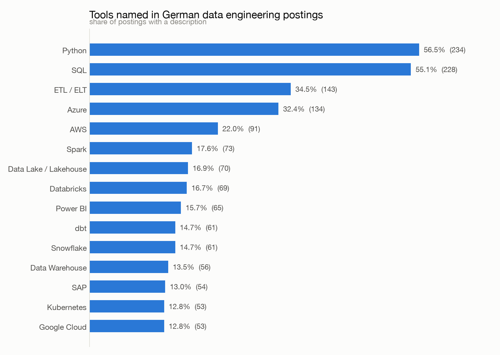
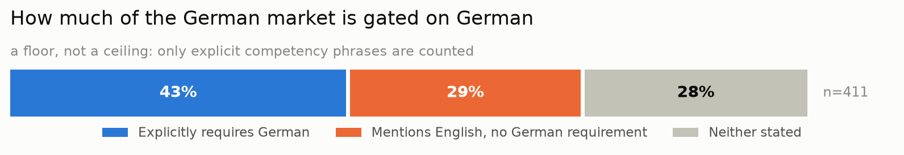

# de-jobs-pipeline

A data pipeline that answers a question I actually needed answered:
**what do German data engineering job postings really ask for?**

Not opinion, not a listicle — postings pulled from two public job APIs,
Germany's official federal database and a second DACH/EU board, parsed and
counted.

> Runs itself every morning. The figures below are regenerated by that run,
> so the prose and the charts always come from the same database.

## Findings

What this measures: postings currently advertised for data engineering roles
in Germany, sampled by a scheduled run every morning. The figures move as the
market does, and the daily snapshots under `data/snapshots/` record each run,
so any number here can be traced back to the run that produced it.

<!-- FINDINGS:START -->

*Postings still being advertised across the 4 daily runs from 2026-09-10 to 2026-09-13. A posting leaves these figures once the sources stop listing it, so this is what the market is asking for now rather than one morning's sample.*

**671 postings** after scope filtering, location validation and deduplication; **665** of them carry a description long enough to read requirements from. Every percentage on this page is a share of those 665.

### Cloud platforms

| | share of postings |
| --- | --- |
| Azure | 27.8% |
| AWS | 20.2% |
| Google Cloud | 12.5% |

Azure appears **1.4×** as often as AWS.

### What the published number is a share of

Stages in the order the pipeline applies them. The last row is the denominator above.

| stage | postings | of previous | of rows read |
| --- | ---: | ---: | ---: |
| rows read | 6,820 | — | 100.0% |
| distinct postings | 5,867 | 86.0% | 86.0% |
| title in scope | 2,149 | 36.6% | 31.5% |
| in germany | 1,912 | 89.0% | 28.0% |
| latest snapshot | 702 | 36.7% | 10.3% |
| still advertised | 702 | 100.0% | 10.3% |
| deduplicated | 671 | 95.6% | 9.8% |
| with description | 665 | 99.1% | 9.8% |

### Language requirement

| requires German | mentions English, no German requirement | neither stated |
| --- | --- | --- |
| **38.8%** | **33.8%** | **27.4%** |

<!-- FINDINGS:END -->

### Which tools the market asks for



Python and SQL are the floor, which is unsurprising. The cloud split is not:
Azure leads and Google Cloud trails both others, consistent with DACH
enterprises being Microsoft shops before they are cloud shops. The ratio
between the clouds has held across samples of very different size, while the
absolute percentages moved — so read the ratio as the finding.

Two results look distinctly German. **SAP** sits in the top fifteen, and
**Power BI** ranks above Spark, dbt and Airflow. A US-based dataset would not
produce that shape. It suggests a large share of what Germany labels "data
engineering" is Microsoft-stack BI work sitting close to SAP systems, which is
a different job from the one the title implies elsewhere.

Read the percentages as a share of all postings, not as market share between
clouds: most postings name no cloud at all, so among those that do, Azure's
lead is wider than the table suggests.

### How much of the market is gated on German



The third slice matters as much as the first two. A posting that says nothing
about language is not evidence of either answer, and counting it as
English-friendly would overstate how open the market is.

### Caveats

- **The German figure is a floor.** Only explicit competency phrases are
  counted. A posting written in German that states no requirement but expects
  German is invisible to this measure, and there are many.
- **A posting counts for seven days after it was last seen.** The warehouse
  keeps thirty days of runs; the figures count postings the sources have
  listed within the last seven. Anything withdrawn leaves the numbers about a
  week later, which is closer to "currently advertised" than either counting
  one morning or counting everything ever seen. The stage table above says what
  each filter costs.
- **Sampling is random but partial.** Descriptions are fetched for a capped
  number of postings per run, shuffled first so the cap is a throttle rather
  than a filter. An earlier version truncated an ordered list and skewed every
  percentage upward; see the commit history.
- **Deduplication is a minor effect, and was measured rather than assumed.**
  The stage table above is generated from `mart_pipeline_funnel`, not written
  by hand: the role filter removes far more rows than deduplication merges.
  `analysis/dedup_audit.sql` goes further into what was merged and why.
- **The second source is DACH/EU-wide, not German**, and states no country.
  Locations are validated against German place names taken from the federal
  database itself, and only verified-German rows are kept.

## Why this project

I am moving from Oracle PL/SQL work into data engineering and needed to decide
which platform to invest in — Azure/Databricks, AWS, or GCP. Rather than guess
from blog posts, I decided to measure the market I want to enter.

## Sources

| Source | Why | Auth |
| --- | --- | --- |
| [Bundesagentur für Arbeit Jobsuche](https://github.com/bundesAPI/jobsuche-api) | Germany's official federal job database, the largest single source of German vacancies | Public client key |
| [Arbeitnow](https://www.arbeitnow.com/blog/job-board-api) | Second source, so that cross-source deduplication becomes a real problem | None |

No scraping. Both sources are public APIs, which keeps the pipeline stable and
within terms of service.

## Model documentation

Every model, column and test, with a clickable lineage graph:
**[atakuruk.com/de-jobs-pipeline](https://atakuruk.com/de-jobs-pipeline/)**

Regenerated by the same scheduled run that builds the models, so the graph
always describes the models that actually exist.

## Architecture

```
API  ->  raw JSON (immutable)  ->  Postgres  ->  dbt  ->  marts  ->  charts
```

The raw layer is never edited. Every downstream table must be reproducible
from the JSON on disk — the same discipline as a staging table you can always
replay.

```
ingest/     API clients, one per source, writing untouched responses
load/       raw JSON -> Postgres
dbt/        staging -> intermediate (dedup, geo, skill parsing) -> marts
analysis/   charts, snapshot export, and the audits behind two decisions
```

It runs itself. A [scheduled workflow](.github/workflows/daily.yml) ingests,
loads, builds and tests every morning into Databricks, then commits the marts
as dated CSVs under `data/snapshots/`. The warehouse keeps the last thirty
days, so the models can ask what a posting looked like yesterday; the CSVs are
committed anyway, because they are small, diffable, and outlive the retention
window.

The schedule is not really about fresh data. It is that dbt's tests run daily
against a live third-party API: if the source changes shape, the build goes
red and says so, rather than the numbers quietly drifting.

## Running it

Requires Docker and Python 3.11 or newer (3.9 reached end of life and
lacks wheels for some of these dependencies).

```bash
cp .env.example .env
docker compose up -d                  # Postgres on localhost:5433

python3.12 -m venv .venv && source .venv/bin/activate
pip install --upgrade pip
pip install -r requirements.txt

python ingest/arbeitsagentur.py --max-pages 5 --with-details
python ingest/arbeitnow.py --max-pages 5
python load/load_raw.py

cd dbt
dbt seed --profiles-dir .
dbt build --profiles-dir .
cd ..

python analysis/make_charts.py
```

Raw responses land in `data/raw/<source>/<date>/`, alongside a `_manifest.json`
recording what the run actually fetched.

## Roadmap

- [x] Raw ingest from both sources, with retry, backoff and run manifests
- [x] Load raw JSON into Postgres
- [x] Cross-source deduplication
- [x] Skill extraction from posting text
- [x] dbt marts: tool frequency, city breakdown, German-language requirement
- [x] Charts and findings
- [x] Daily scheduled run, with dbt's tests running against the live API
- [ ] Airflow, if and when the job stops being one linear sequence
- [ ] Port the dbt models to Databricks

## Licence

MIT
